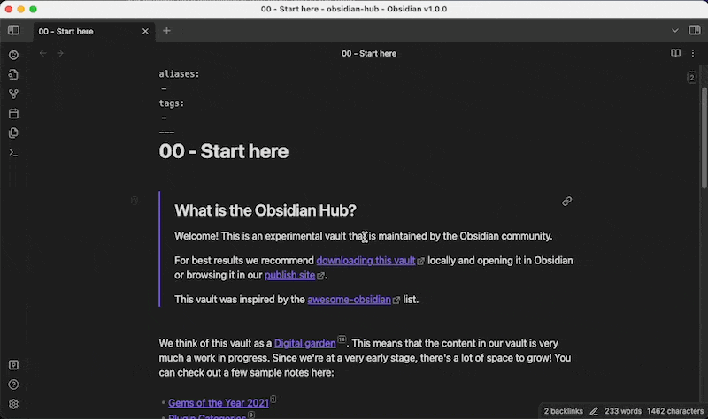
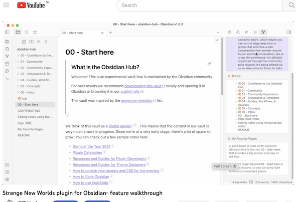
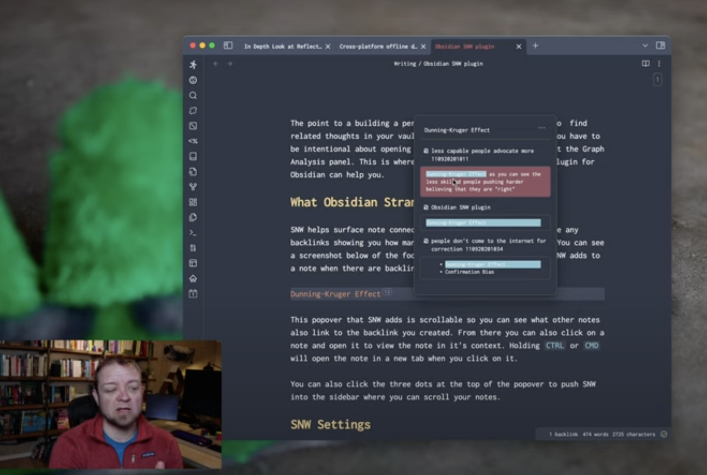

# Strange New Worlds of networked thought
This plugin helps you to see the connections between the different parts of your vault.

The basic idea is we want to see when links, block references and embeds have associations with other files in the vault. The problem is you have to search, open backlinks and so on to find out what is going on. But there are so many strange new worlds of networked thought to discover in our vault. This plugin attempts to resurface those connections and not be to intrusive (or not too intrusive) in doing so.

The Strange New Worlds plugin is abbreviated as SNW in this documentation.

SNW has been tested to work on mobile device and tablets.

Check out this video for an overview of this plugin: 

More features

Reviews

- Great review by Curtic McHale

# Lazy networking (linking)
We are not known to be lazy, but for this plugin we had to be. This plugin leverages the indexing Obsidian does in the background, which is amazing. However, for performance reasons some things don't update right away. So depending on what you are doing, reference counts sometimes shown by this plugin may be incorrect as you work with links, embeds and blocks. But eventaully they will be correct as the cache updates itself. It is better than nothing, right? 

# Incompatiblities
Sadly there can be some plugin incompatibilities. No one is at fault, but we all fight for the same resources in Obsidian. I will maintain a list of issues here:
+ Excalidraw: SNW does now show the counter
+ Kanban: SNW does not show the counter
+ Tasks plugin: on task lines, SNW won't show the counter in Reading View (though works in live preview)

# SNW References
When a reference is displayed either in a hover popup or the sidepane, it can be clicked to be opened. By default it will open in the current pane. However using the following keyboard commands, you have more control over how they open.
+ Opens a tab if the modifier key Cmd/Ctrl is pressed OR if this is a middle-click MouseEvent.
+ Opens a split pane if Cmd/Ctrl+Alt is pressed.
+ Oepns a new window if Cmd/Ctrl+Alt+Shift is pressed.

# Startup and Toggling SNW counters on/off
+ In Settings: you can configure if SNW counters are active on startup for desktop and mobile. For example, this allows you to have SNW active in the desktop and make it inactive on mobile.
+ Command palette: toggle SNW counters on and off. When used, it is valid for the current session. Otherwise, the on/off state is controlled based on their startup settings in Settings.

# SNW frontmatter directives
The following can be added to a file's front matter to provide more control to SNW's behavior
+ add `snw-index-exclude: true` - prevents SNW from including this file in its index. This means any links to this file will not display block counts
+ add `snw-file-exclude: true` - prevents any block reference counters from being displayed on the current page. Basically turns off SNW for the file. NOTE: This will not affect embedded links. Embed files must have this YAML property set as well to have its counters excluded.

# Exclude Obsidian's ignored folders
When this is toggled on in SNW settings, the plugin will skip processing files in Obsidian's ignore folder list from Settings > Files & Links > Exclude Files.

# odd issues
Modifying the underyling Obsidian rendering engine is not easy. It is a complex piece of software. There are some issues we have not been able to resolve, so we had to compromise. We will list such examples as they surface here:
- An embed marked to render its display that is on its own line will force the reference counter to the next line. So if you have typed on a line something like this, all by itself: `![[MyPage#header1]]` it will show any block reference counts on the following line. However if the same text is entered as: `- ![[MyPage#header1]]`, that is, with any other text, it will render the block references as by design.

## Credit
I need to thank [Sam](https://github.com/Shabegom) and [Murf Man](https://github.com/gitmurf) for all their inspiration and work from this plugin: https://github.com/shabegom/obsidian-reference-count. 

# Say Thank You
If you are enjoying this plugin then feel free to buying me a coffee on [https://ko-fi/TfTHacker](https://ko-fi.com/TfTHacker).

Please also help spread the word by sharing your enthusiasim for this plugin on Twitter, Reddit, or any other social media platform you regularly use. 

You can find me on Twitter [@TfTHacker](https://twitter.com/TfTHacker)

