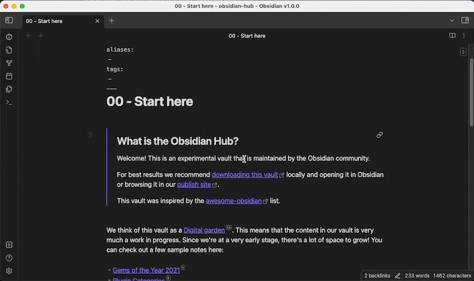

# Strange New Worlds of networked thought

> [!IMPORTANT]
> This plugin is looking for new maintainers. Interested? [Read more here](https://github.com/TfTHacker/obsidian42-strange-new-worlds/issues/195).

---

This plugin helps you to see the connections between the different parts of your vault.

The basic idea is we want to see when links, block references and embeds have associations with other files in the vault. The problem is you have to search, open backlinks, and so on to find out what is going on. But there are so many strange new worlds of networked thought to discover in our vault. This plugin attempts to resurface those connections and not be too intrusive (or not too intrusive) in doing so.

Documentation for this plugin can be found at: https://tfthacker.com/SNW

See videos on how to use Strange New Worlds: https://tfthacker.com/SNW-videos

## Ways to connect with me and more information on my work

You can find me on Twitter [@TfTHacker](https://x.com/TfTHacker)

My website https://tfthacker.com/
